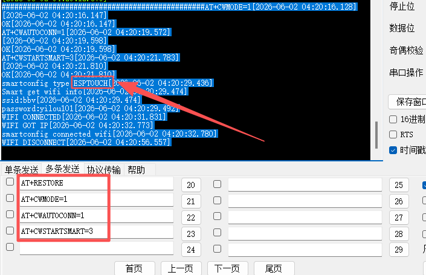

自动连接wifi AT指令
1. AT+RESTORE 
2. AT+CWMODE=1
3. AT+CWAUTOCONN=1
4. AT+CWSTARTSMART=3

# 命令解释
1. AT+RESTORE：恢复出厂设置，清除之前的配置。
2. AT+CWMODE=1：设置为station模式，用于连接其他设备。
3. AT+CWAUTOCONN=1：设置自动连接，当wifi信号强度足够时自动连接。
4. AT+CWSTARTSMART=3：设置为3: ESP-TOUCH+AirKiss

使用软件 smartconfig

